<!-- ════════════════════════════════════════════════════════════════════════
     PROFILE README · github.com/beepboop2025
     Designed in the "Textura" key — near-black, editorial serif, warm→cyan
     gradient. The hero is a self-contained animated SVG (hero.svg) in this
     repo; the stats cards are themed to the same palette. No build step.
════════════════════════════════════════════════════════════════════════ -->

  

  
  &nbsp;
  

OSINT &amp; INTEL&nbsp;&nbsp;·&nbsp;&nbsp;AI / MCP&nbsp;&nbsp;·&nbsp;&nbsp;FINTECH&nbsp;&nbsp;·&nbsp;&nbsp;FULL-STACK

---

I build **full systems, not demos** — from the collectors and message queues at the bottom to the dashboards and agents at the top. My work clusters around three obsessions: making opaque real-world data **legible**, giving AI agents **tools they can trust**, and **financial infrastructure** that holds up. Python &amp; TypeScript · FastAPI &amp; Next.js · Kafka &amp; Postgres.

## ▸ Selected work

| | project | what it is |
|---|---|---|
| ★ | **[social-scraper](https://github.com/beepboop2025/social-scraper)** | OSINT + financial-NLP platform — 26 collectors → Kafka/TimescaleDB → FastAPI, featuring **PALIMPSEST**, a China latent-state intelligence engine |
| ★ | **[operatoros](https://github.com/beepboop2025/operatoros)** | Cross-border tax platform for NRIs — Residency, DTAA, §195, FTC, Customs &amp; a live World Tax Radar. FastAPI + React, ~160 tests, CA-backed engines that refuse to guess |
| ◆ | **[vitalchain](https://github.com/beepboop2025/vitalchain)** | Pharma supply-chain command center — India-first serialization, cold-chain, NSQ watch &amp; recall tracking, with an award-grade WebGL landing (Next.js 16) |
| ◆ | **[DragonScope](https://github.com/beepboop2025/DragonScope)** · [live ↗](https://dragonscope.vercel.app) | Bloomberg-style terminal — 45+ panels, ML signals, in-browser SQL, real-time WebSocket feeds, correlation engine |
| ◆ | **[groundcheck](https://github.com/beepboop2025/groundcheck)** · [live ↗](https://groundcheck-three.vercel.app) | The grounding check agents run before they answer — an MCP server that verifies a claim against live sources and returns a verdict + citations |
| ◆ | **[pdf-toolkit-mcp](https://github.com/beepboop2025/pdf-toolkit-mcp)** | MCP server with 37 tools for reading, creating, merging, watermarking, redacting &amp; filling PDFs |
| ◆ | **[snapmock](https://github.com/beepboop2025/snapmock)** · [live ↗](https://snapmock-orpin.vercel.app) | Turn screenshots into beautiful mockups in seconds — free, private, no sign-up |
| ◆ | **[drug-price-observatory](https://github.com/beepboop2025/drug-price-observatory)** | Public-good explorer making UNODC/INCB drug-trade data legible — street prices, precursor flows, corridors |

## ▸ The work clusters

**🛰 Intelligence &amp; OSINT** — [social-scraper](https://github.com/beepboop2025/social-scraper) · [palimpsest-china-intel](https://github.com/beepboop2025/palimpsest-china-intel) · [economic-intelligence-agent](https://github.com/beepboop2025/economic-intelligence-agent) · [econscraper](https://github.com/beepboop2025/econscraper) · [drug-price-observatory](https://github.com/beepboop2025/drug-price-observatory)

**🤖 AI tooling &amp; MCP** — [groundcheck](https://github.com/beepboop2025/groundcheck) · [pdf-toolkit-mcp](https://github.com/beepboop2025/pdf-toolkit-mcp) · [ai-analytics](https://github.com/beepboop2025/ai-analytics) · [medprep-ai](https://github.com/beepboop2025/medprep-ai)

**📈 Fintech &amp; data** — [operatoros](https://github.com/beepboop2025/operatoros) · [DragonScope](https://github.com/beepboop2025/DragonScope) · [LiquiFi](https://github.com/beepboop2025/LiquiFi) · [vitalchain](https://github.com/beepboop2025/vitalchain) · [ReadyState](https://github.com/beepboop2025/ReadyState) · [chainguard](https://github.com/beepboop2025/chainguard) · [umbra-xmr-bridge](https://github.com/beepboop2025/umbra-xmr-bridge)

## ▸ Signals

  
  

## ▸ Doctrine

> **Treat the censor as a sensor.**&nbsp; What a regime deletes — how fast, how selectively — reveals what it fears.
>
> **Estimate the hidden state.**&nbsp; Every feed is one biased measurement; the truth lives in the triangulation.
>
> **Honest data states.**&nbsp; Every view is badged `● LIVE` / `● SNAPSHOT` / `● SAMPLE` — the system flags stale data rather than fabricating signal to fill a gap.

## ▸ Let's connect

  
  &nbsp;
  

Open to interesting problems — intelligence, AI tooling &amp; fintech infrastructure. The <strong>engines are public</strong>; the data &amp; deploys aren't. Curious what the full systems do? <strong>Reach out.</strong>

---

□&nbsp;&nbsp;built in the Textura key&nbsp;&nbsp;·&nbsp;&nbsp;<a href="https://beepboop2025.github.io/">beepboop2025.github.io</a>

